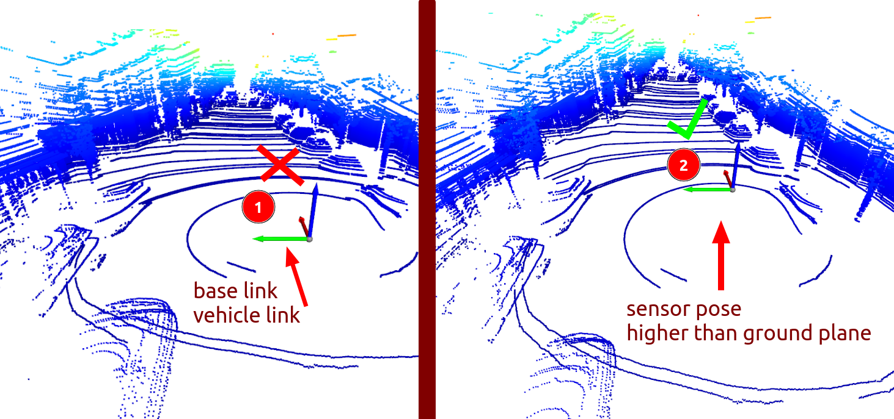

Popular Dataset config
---

> [!IMPORTANT]  
> We assume that you set the (0,0,0) at the sensor center position where sensor located. 
> Since I knew some data process will set to base link which will cause the sensor height parameter doesn't work.

Here is what I mean, all visualization here are provided by [DeFlow vis scripts](https://github.com/KTH-RPL/DeFlow/blob/main/tests/scene_flow.py):

`${#lidar}x ${#channel} lidar` mean how many lidar and how many channel lidar in the dataset.

- [x] KITTI: 1x 64 lidar
- [x] Nuscenes: 1x 32 lidar
- [x] Argoverse 2: 2x 32 lidar
- [x] [Zod](https://zod.zenseact.com/): 128 lidar + 2x 16 lidar
- [ ] [Semi-indoor](https://github.com/KTH-RPL/DynamicMap_Benchmark?tab=readme-ov-file#dataset--scripts): 1x 16 lidar
- [ ] Waymo: 1x custom 64 lidar.
- [ ] [Scania](https://kin-zhang.github.io/HiMo): 6/10x 32 lidar.
- [ ] [TruckScene](https://github.com/TUMFTM/truckscenes-devkit): 1x 128 lidar.
... More on the way